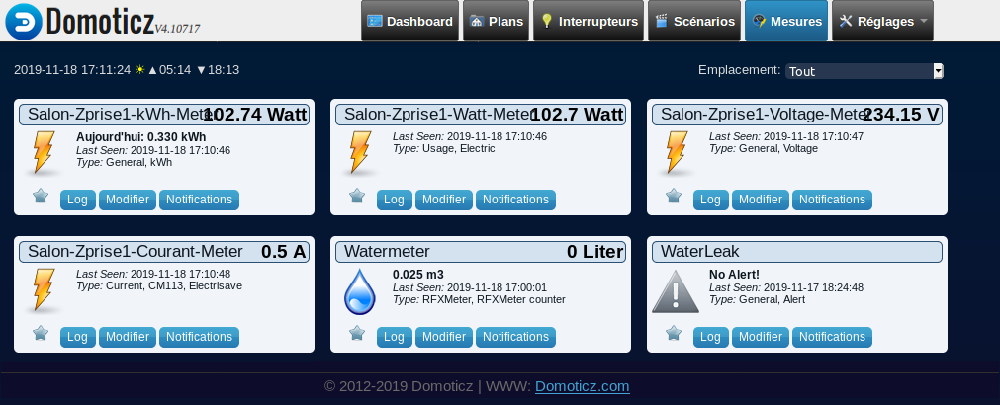

Wifi Water Meter Pulse Sensor
=============================

Software:
---------

C++ source

* MQTT transmissions data every hour,
* adjustment (during compilation) of the unit of diffusion,
* log history every hour in flash memory,
* retention of records on system time synchronization defect and re-indexing on synchronization recovery before historization,
* monitoring of the consumption for detection of possible leaks in the water network,
* configuration of the monitoring parameters via the Web interface,
* MQTT alerts about possible leaks to the home automation device (Domotics, Jeedom, ...).
* 3 configurable SSID,
* web interface configuration,
* definition of IPs (such as the reverse proxy) excluded from configuration changes; allows secure exposure of the home page to the Internet,
* debug trace available by telnet console,
* firmware update via WiFi, without loss of data and setting,
* accepts HTML commands from the home automation software: current counter value, log history recovery in JSON format, clear current history, backup of current measures with reboot, ...

* Screenshots:

* 

* 

* MQTT parameters:

* 

* 

* Virtual sensor creat & edit:

* 

* 

* 

* Map:

* 

Hardware:
---------

* ESP8266 Mini WiFi Nodemcu Module with 18650 battery support (autonomy of about 17h in case of power failure):

* 

