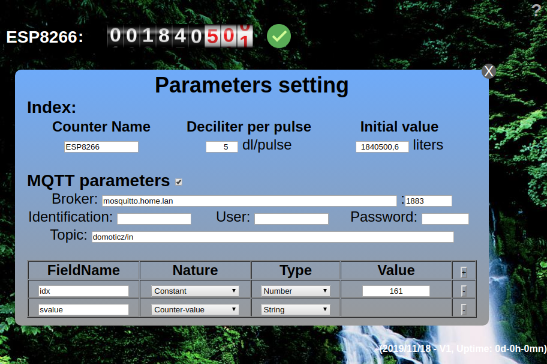
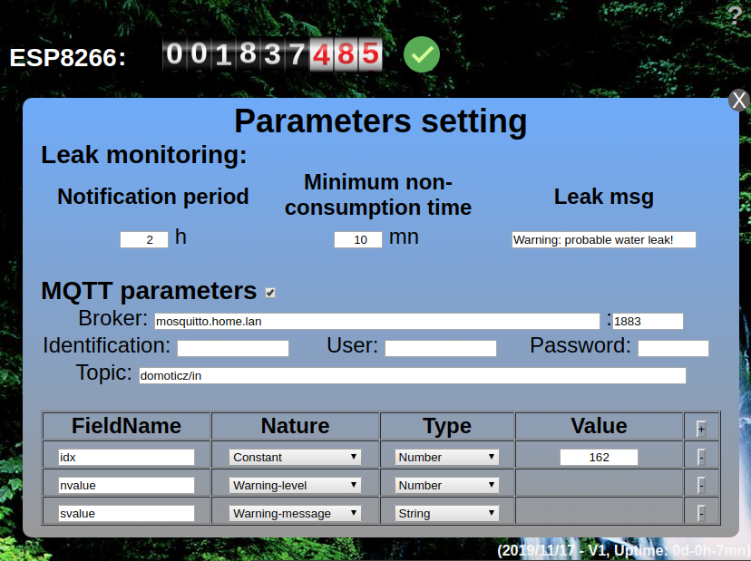

Wifi Water Meter Pulse Sensor
=============================

Software:
---------

C++ source, HTML, Javascript & JSON format.

* MQTT transmission of data each hour,
* log history each hour in flash memory,
* adjustment (setting.h) of the unit of diffusion,
* retention of records on system time synchronization defect and re-indexing on synchronization recovery before historization,
* monitoring of the consumption for detection of possible leaks in the water network,
* configuration of the monitoring parameters via the Web interface,
* MQTT alerts about possible leaks to the home automation device (Domotics, Jeedom, ...).
* 3 configurable SSID,
* web interface configuration,
* definition of IPs (such as the reverse proxy) excluded from configuration changes; allows secure exposure of the (only) home page to the Internet,
* debug trace available by telnet console,
* firmware update via WiFi, without loss of data and setting,
* accepts HTML commands from the home automation software: current counter value, log history recovery in JSON format, clear current history, backup of current measures with reboot, ...
* modem sleep option allowed between measures...

Http request available :
<table>
  <tr>
    <td><tt>http://IPAddress</tt></td>
    <td>WEB User Interface</td>
  </tr>
  <tr>
    <td><tt>http://IPAddress/getCurrentIndex</tt></td>
    <td>current counter value</td>
  </tr>
  <tr>
    <td><tt>http://IPAddress/getData</tt></td>
    <td>data file - all measures saved [Unix date, counter index]</td>
  </tr>
  <tr>
    <td><tt>http://IPAddress/getCurrentRecords</tt></td>
    <td>not yet indexed values (on NTP error)</td>
  </tr>
  <tr>
    <td><tt>http://IPAddress/resetHistoric</tt></td>
    <td>current data file will be erased after DELETEDATAFILE_DELAY (ms)</td>
  </tr>
  <tr>
    <td><tt>http://IPAddress/modemSleepAlowed</tt></td>
    <td>UI available during AWAKETIME (s) before and after each hour</td>
  </tr>
  <tr>
    <td><tt>http://IPAddress/modemSleepAlowed</tt></td>
    <td>WiFi always connected and UI always available (maximum power consumption)</td>
  </tr>
  <tr>
    <td><tt>http://IPAddress/restart</tt></td>
    <td>save current measure and reboot</td>
  </tr>
</table>

* Screenshots:

* 

* 

* MQTT parameters:

* 

* 

* Virtual sensor creat & edit in Domoticz:

* 

* 

* 

* Map:

* 

Hardware:
---------

* ESP8266 Mini WiFi Nodemcu Module with 18650 battery support (autonomy more than 10h in case of power failure), 1 x zener 3.3v, 1 x 360R, 1 x USB-A connector, 1 x 2 pins xh 2.54mm female connector :

* 

* 

* 

* 

